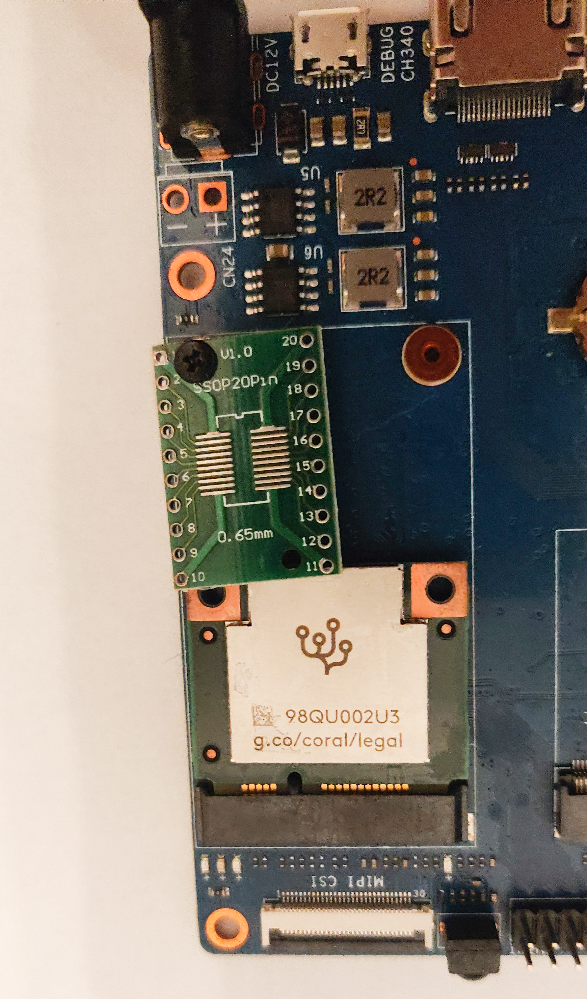
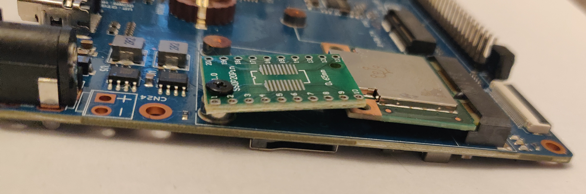
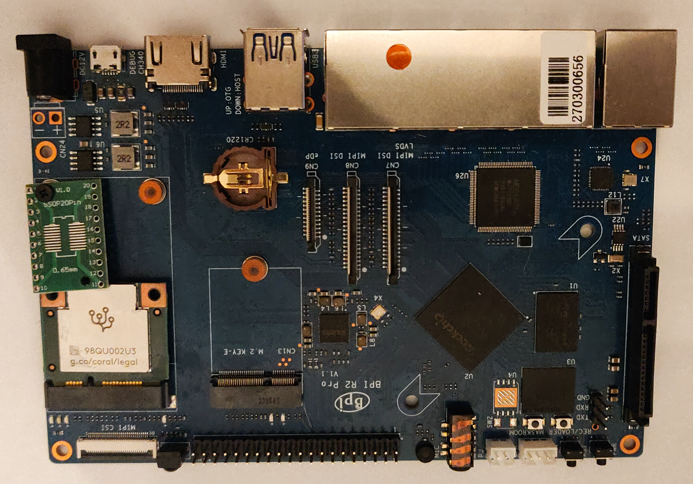

# Installing Google Coral TPU mPCIe on Banana Pi R2 Pro

In order to use a TPU ASIC from Google we have only 3 main options (not taking into consideration SoMs and Boards): 
- Google Coral USB Accelerator;  
- Google Coral M.2 Accelerators (various types);  
- Google Coral mPCIe Accelerator

Since I had a mPCIe TPU and using it with a laptop wasn't really handy (the laptop need to be ON all the time), I searched for a SBC that would fit this module and would work with it detecting objects/persons in video streams.

From SBCs that are not so expensive and are easy to buy in single unit there are not so many that have a mPCIe interface. even if there are some (e.g. Orange Pi or Raspberry Pi CM) that have it, this TPU board is not usable with them.

In the same time Banana Pi have some boards with mPCIe interfaces (BPI R2, BPI R64, BPI R2 PRO) and, after finding a forum discussion about some working examples [here](https://forum.banana-pi.org/t/bpi-r64-pcie-issues/10284/4), I bought one.

TLDR:  
It's working and bellow I'll describe how to make it work.  

## Hardware 'hack'
After the SBC arrived I understand the meaning of a "a half-size Mini PCIe module" that Coral mPCIe Accelerator is (while in the description of BPI R2 Pro no 'half-size' part can be found)- the module fits in the socket, but there's no way to keep it in place by default.

So in order to fix it I used a random PCB to keep it in place:

  

  

  

I am sure that there are better ways to do it, but it works this way too :).  

## Finding a OS that will work with Coral Accelerator

After trying Ubuntu and Debian compiled for this board, I decided to go with Armbian. It seemed to me easier to install and to use.

### Installing Armbian  

As recomended [here](https://docs.armbian.com/User-Guide_Getting-Started/:)

1. download usbimager from https://gitlab.com/bztsrc/usbimager/  

2. download armbian CLI -> https://mirror.yandex.ru/mirrors/armbian/archive/bananapir2pro/archive/Armbian_23.02.2_Bananapir2pro_bullseye_current_6.1.11.img.xz  

    The version is important since it will contain Python 3.9 which we need for Coral Accelerator to work!  

3. write to an SD card using usbimager (I used an 32G one)

4. insert the SD card in the BPI board and power on the board - the OS will expand and set up everything.  
5. After you'll login, in armbian-config select to install on EMMC, let it install and after it will power off - remove the SD Card.
6. Power on the board without the SD card and login.
7. update and upgrade
8. Download specific headers - we will need them to build gasket drivers - by using:  
    <code>wget https://mirrors.dotsrc.org/armbian-apt/pool/main/l/linux-6.1.11-media/linux-headers-current-media_23.02.2_arm64.deb</code>  
    The version is important, to mach the installed kernel  

9. Install the downloaded headers by using (in the folder where you used wget):  
    <code>sudo dpkg -i linux-headers-current-media_23.02.2_arm64.deb</code>  

### Installing drivers needed for Coral Accelerator  
As here https://coral.ai/docs/m2/get-started/

